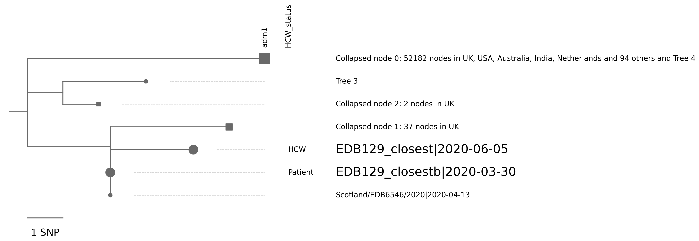
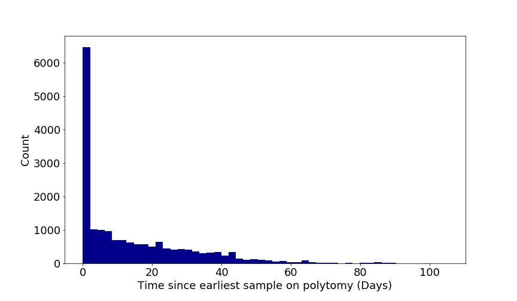

## Cluster investigation

The following sequences have failed QC:

 - This_seq_is_too_short Sequence too short: only 5052 bases.
 - This_seq_has_lots_of_Ns Sequence has too many Ns: 98.0\% of bases
 - This_seq_is_literally_just_N Sequence has too many Ns: 100.0\% of bases

6 queries (5 matched to COG-UK database).
1 additional sequences provided.

> **Table 1**| Queries found in COG-UK database.

| Query ID   | Sequence name in Tree   | Sample date   | UK lineage   | Global lineage   | Phylotype      | Tree   | HCW_status   | care_home   | adm1     |
|:-----------|:------------------------|:--------------|:-------------|:-----------------|:---------------|:-------|:-------------|:------------|:---------|
| EDB3588    | Scotland/EDB3588/2020   | 2020-02-33    | UK175        | B.1.93           | UK175_1.55.1.1 | Tree 4 | HCW          | C           | Scotland |
| EDB2533    | Scotland/EDB2533/2020   | 2020-02-34    | UK5          | B.1.1            | UK5_1.58       | Tree 3 | Patient      | D           | Scotland |
| PHEC-1A65C | England/PHEC-1A65C/2020 | 2020-02-35    | UK120        | B                | UK120_1        | Tree 1 | HCW          | A           | England  |
| PHEC-1AD2A | England/PHEC-1AD2A/2020 | 2020-02-36    | UK120        | B                | UK120_1        | Tree 1 | NA           | NA          | England  |
| PHEC-1A917 | England/PHEC-1A917/2020 | 2020-02-37    | UK120        | B                | UK120_1        | Tree 1 | Patient      | D           | England  |

> **Table 2**| Queries matched to closest COG-UK sequence using input sequences

| Query ID        | Sample date   | Closest sequence in Tree   |   Distance to closest sequence | SNPs   | UK lineage   | Global lineage   | Phylotype   | Tree   | HCW_status   | care_home   | adm1   |
|:----------------|:--------------|:---------------------------|-------------------------------:|:-------|:-------------|:-----------------|:------------|:-------|:-------------|:------------|:-------|
| EDB129_closestb | 2020-02-30    | Scotland/EDB1813/2020      |                              0 |        | UK175        | B.1.71           | UK175_1.15  | Tree 2 | Patient      | A           | NA     |

## Phylogenies

#### Tree 1
3 sequences of interest
   

#### Tree 2
1 sequence of interest
   

#### Tree 3
1 sequence of interest
   

#### Tree 4
1 sequence of interest
   

### SNPs found in sequences of interest

## Appendix

This report summarises the information provided by whole genome sequencing of SARS-COV-2 generated by the COG consortium. 
It is intended to provide an additional layer of analysis for infection control efforts, and to aid in the investigation of outbreak clusters.

For each query sequence, CIVET either finds them in the COG database, or matches them as closely as possible to a sequence in the COG database, and puts them into a UK lineage.

Key points for interpreting this information:

 - This type of analysis is not able to infer direct transmission between two samples. Even identical sequences may be unrelated as SARS-COV2 is relatively slow evolving for an RNA virus. Previous analysis has shown that samples taken over 100 days apart can be identical. 
 - If sequences have different global or UK lineage designations, we can rule out close epidemiological linkage.
 - If sequences have different phylotypes it’s very unlikely that they are direct transmissions. 
 - If sequences share the same lineage and the same phylotype, transmission cannot be ruled out and also cannot be confirmed.

The figure below shows the distribution of time differences that two sequences can be sampled and still be identical. 
It is to illustrate that identical sequences does not confirm linked cases.

### Useful definitions

*Phylotype* 

Each lineage phylogeny is labelled with phylotypes that describe shared mutations in the tree. If two sequences have the same phylotype it means the share mutations. They may also have additional, unique mutations. So having the same phylotype doesn't mean the seqeunces are identical. If sequences have different phylotypes however it means they are present on distinct parts of the phylogenetic tree.

*UK lineage* 

UK lineages are an approximation to distinct introductions of SARS-CoV-2 to the UK based on the phylogenetic tree.

*Global lineage* 

Assigned using the pangolin software, these are phylogenetic lineages. More information can be found at https://github.com/hCoV-2019/lineages

### Software versions

This report was made using:

Python 3.6.11
Matplotlib version 3.3.1
Pandas version 1.1.0
Tabulate version 0.8.7
CSV version 1.0
Numpy version 1.19.1
Scipy version 1.5.2
No version number for Baltic
COG data is now submitted every day, so the background data was updated yesterday
CIVET version is 0.1

## Acknowledgements

This report was generated by CIVET.

The background data from the UK was generated by the COG consortium (https://www.cogconsortium.uk/), a national, multi-centre consortium for the sequencing and analysis of SARS-CoV-2 genomes for Public Health.

We also use some background data from GISAID (https://www.gisaid.org/) in the phylogenies. We thank everyone involved in the global sequencing effort for making their data available. 

Tree data was visualised using baltic (https://github.com/evogytis/baltic)

Mapping data was downloaded from the Global Administrative Database (https://gadm.org/) and Natural Earth (https://www.naturalearthdata.com/)

