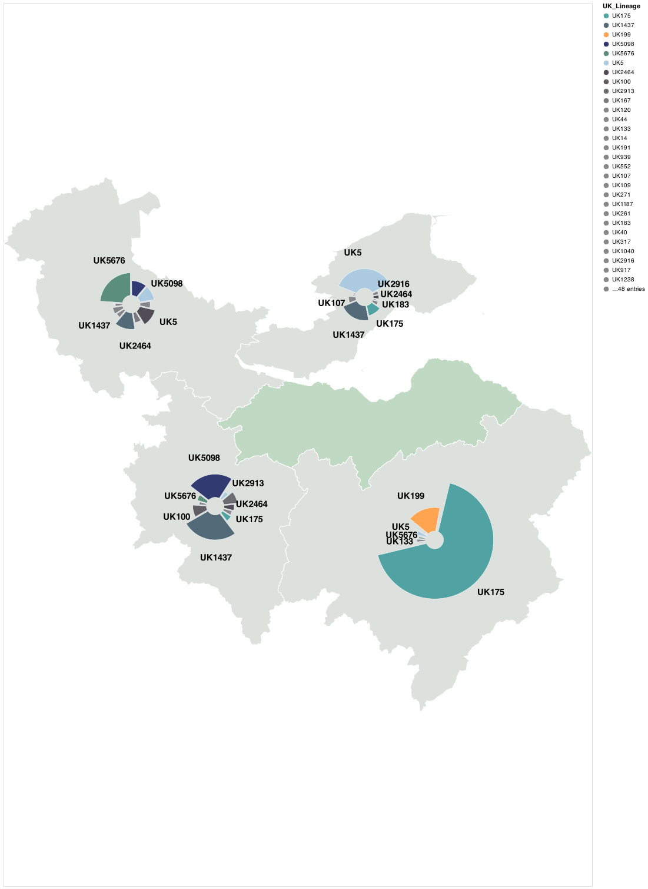
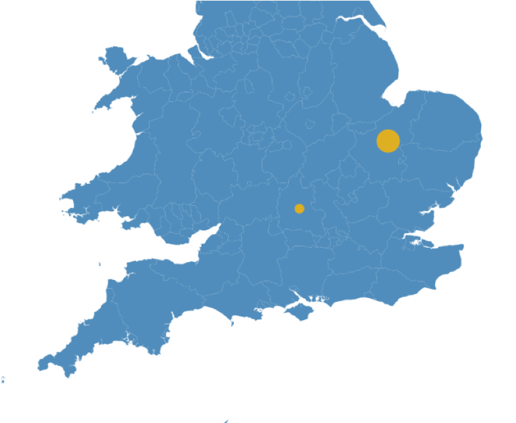
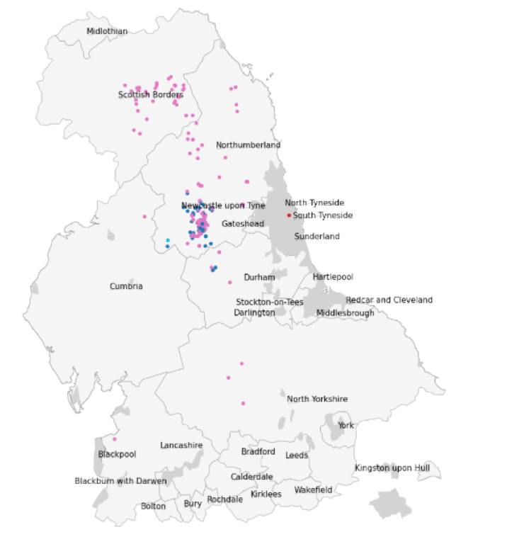

## Mapping options

How to visualise the geographical data in sequences using civet

> Note: All of these options require some geographical information, either in the background data or the input query information.

### --local-lineages and associated options

The local lineages option runs an analysis to show the composition of background lineages. It shows the distribution of UK lineages in the Adm2 regions that the query sequences are in, as well as the neighbouring adm2 regions. This can be used to see whether the distribution of UK lineages found in the query dataset is representative of the nearby region or not.

It requires Adm2 information for the query sequences and for sequences in the background metadata. It can therefore only be run on CLIMB.

By default this background information will be provided for the whole timeframe present in the background metadata. However there are a number of options to restrict this dataset.

First, use the flag **--date-restriction**  or specify **date_restriction: True** in the config.

**--date-window** followed by a number restricts the date to the number of days before and after the date range in the query dataset.

**--date-range-start** and **--date-range-end** can be used to restrict the analysis to specific dates given in YYYY-MM-DD format. If only the former is specified, then the analysis will be restricted from then to the present.

If only **--date-restriction** is specified, then the analysis will be restricted to 7 days before and after the date range of the query.

Example is shown below:

### --map-sequences and associated options

To plot the sequences in the query, use the **--map-sequences** option.

There are three options for input: adm2, outer postcode and sequence coordinates. Use **--map-info** to specify which columns contain the geographical data. For adm2, it will show one dot per adm2, sized by the number of sequences in that adm2 region. If it is outer postcode or coordinates, one dot will be shown by sequence.

If using adm2, this column should be "adm2", and if using coordinates there should be separate columns containing the x axis data and the y axis data, provided as a comma separated string in that order. Outer postcode should be a single column, but can be named anything.

If providing cooordinates, the coordinate reference system (CRS) they are in must also be specified using the **--input-crs** option. Some common CRSs are EPSG:3395 and EPSG:4326 (eg Manchester in the former is 7038432.30, -248267.47 and in the latter is 53.5,-2.28). If the map that is produced looks odd (for example, the dots showing the sequences are very far away from the map of the UK), it is worth checking the CRS.

If using coordinates or outer postcodes, the dots showing where the sequences are may be coloured by their metadata. Provide the column containing the data by using the **--colour-map-by** option. 

Examples:

#### Adm2 map

#### Outer postocde or coordinate map with a trait coloured

### [Next: Acknowledgements](./acknowledgements.md)
