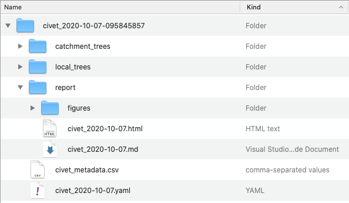

## Output options

Description of output civet directory

### -o / --output-prefix and --outdir

An output prefix can be specified with `-o /--output-prefix`. If no output directory is specified, by default the directory will be a timstamped directory beginning with the `output_prefix` and the report files will be called `output_prefix`.md  (Default: civet) The output directory can be specified with `--outdir`, which overwrites the `--output_prefix` directory name. See example in the figure below:

### Output files

<strong>catchment_trees</strong>

A directory of the catchment trees, with corresponding text files of the content of each collapsed node (will not have the additional fasta input added in at this stage, these are the trees clipped directly out of the global tree)

<strong>local_trees</strong>

A directory of the collapsed local trees, with corresponding text files of the content of each collapsed node. 

<strong>report</strong>

A directory containing a report in markdown and html formats. The report has summaries of lineages and genetic diversity present in the sequences of interest. Trees are visualised in the report and compared to the diversity of lineages present in the community. Optional figures include summary barcharts of collapsed-node composition, genome 'snipit' graphs and maps of the local community diversity. Full report options described [here](./report_docs.md).

This directory also contains a `figures` directory that contains the figures linked to the report.  

<strong>civet_metadata.csv</strong>

A csv containing all the metadata for the queries provided that were found in the COG database, drawn from any query metadata provided and supplemented with any found in the background metadata. A filtered version is presented in the report itself. It also includes any sequences provided in a fasta file which were not found in the COG database.

<strong>Config yaml file</strong>

The final config file that gets passed to the report (can be used as a template to run additional analyses).

<strong>query.failed_qc.csv</strong>

If a fasta file is input, this file will show details of any sequences that didn't pass the quality control cut offs and why. For example:

| name | reason_for_failure |
| --- | --- |
| seq1  | fail=seq_len:5052 |
| seq2 | fail=N_content:0.98 |
| seq3 | fail=N_content:1.0 | 
| seq4 | fail=not_in_query_csv | 

<strong>query.post_qc.fasta</strong>

A file of input fasta sequences that passed the quality control cut offs.

### --no-temp

With the ``--no-temp`` flag, many more intermediate files are output, including the local tree files prior to collapse. 

### [Next: Report options and descriptions](./report_docs.md)