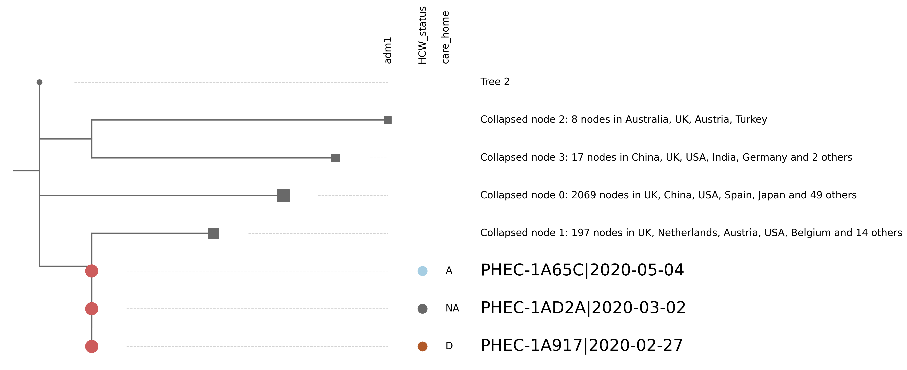
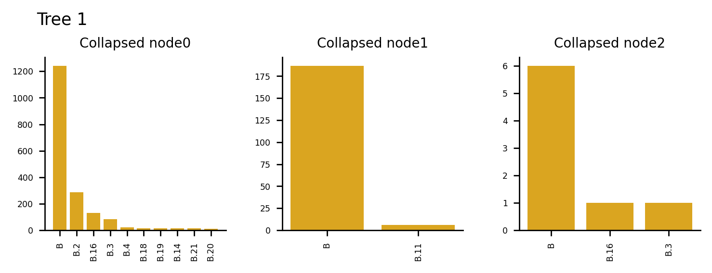

<section id="banner">
    <div class="content">
      <header>
        <h2>Report options</h2>
        <p>Details of how to customise the civet report</p>
      </header>
    </div>
    <span class="image object">
        
        </span>
</section>


### Free text options

Using the config file, there are several points where fully customisable free text can be added.
These are: Title, outbreak ID, report date (default is today), author list, description (introduction) and conclusions. To include multi-line free text, put a ">" character and the start of the free text, and include the new line character ("\n") where the new lines should go.

Eg:
```
description: > 
  ### Background \n
   This report describes the investigation into an outbreak in the made-up region.
```

### Sequencing centre 

Using the flag "--sequencing-centre" on the command line or the option "sequencing_centre" in the config file followed by an accepted four letter abbreviation for the sequencing centre (eg EDIN for Edinburgh or BIRM for Birmingham) will add that sequencing centre's logo into the header of the report. If you do not specifiy a custom title, it will also add the abbreviation into the title.


### Display name

Specify a column in the query csv to refer to query sequences by in the report instead of COG IDs. The default is the same as input column, which by default is name. This may be a patient ID for example to make it more quickly and easily interpretable. This name will be used in the phylogeny and the summary table.


### Sample date column

Specify column in the query csv that contains the sampling date. Default is "sample_date". 

### Tree fields and colour by

A comma separated string containing the column headers of metadata to show on the phylogeny. They will be shown to the right of the corresponding tip, and can be drawn from the query csv or the background metadata csv. 

The default is to place the text found in the appropriate entry in the metadata into the tree. However, by using --colour-by the data can be shown as coloured tips instead. A colour scheme can also be provided, as long as it is matplotlib compatible (see https://matplotlib.org/3.1.1/gallery/color/colormap_reference.html for a list of approved colour maps). The default is "Paired".

To use colour-by, provide a comma separated string of fields. To add the colour scheme, use a ":" or a "=". For example:

```adm1=viridis, adm2=plasma,care_home```

will colour adm1 and adm2 with the specified colour schemes, and care_home by the default colour scheme. 

Any tree fields will be shown in between the tip and the label, going from left to right.

If no colour-by is provided, the tips will be coloured by adm1 ie England, Scotland, Wales or Northern Ireland.

NB Fields in colour-by must also be present in the tree-fields list.



### Label fields and private

A comma separated string of metadata headers containing information to be displayed in the labels in the phylogeny.

By default, the display name and sample date will be used, and if adm2 is present in either metadata (for example if you ran on CLIMB) this will also be shown unless the **--private** flag is used. 

If any fields are provided using the label fields option, these will be overwritten, and the display name and specified fields will be shown. 

For example, a sequence has the following metadata:

Display_name: EDB1234
Adm1: Scotland
Adm2: Edinburgh
Date: 2020-09-23
Care home: A

The default label not on CLIMB or with the **--private** flag would be:
"EDB1234|2020-09-23"

On CLIMB and with no **--private** flag it would be:
"EDB1234|Edinburgh|2020-09-23"

and using 
```--label-fields adm1,care_home``` 
regardless of CLIMB status or **--private** flag will show:
"EDB1234 |Scotland|A"

Therefore once you specify *any* label fields, you must specify all those that you want other than the display name.

### Date fields

Provide column headers from the query metadata or the background metadata as a comma separated string that contain date information to plot those dates on a timeline. 

NB all date formats must be in YYYY-MM-DD format.


### Node summary and include bars

Provide a header in the background metadata table to summarise collapsed nodes by in the phylogeny. Default is country.

If **--include-bars** is called, this information will also be displayed as bar charts.





### Table fields and include snp table

The table shown in the report will always include:
- Query ID
- Name of the query in the tree if the sequence is in the background metadata OR the name of the closest sequence in the tree if the query has not been found in the background metadata
- The local tree ID in the report for each query

By using **--table-fields** a comma separated string of metadata column headers may be provided to add other elements to the table.

In addition, for those sequences not found in the metadata, **--include-snp-table** may be called to display:
- SNP distance to closest sequence in the metadata
- What those SNPs are

in the second table.

### No-snipit

By using this flag, the Snipit table (table showing location of SNPs in the alignment) is removed from the report.

### Omit appendix

Removes appendix from the report. 


